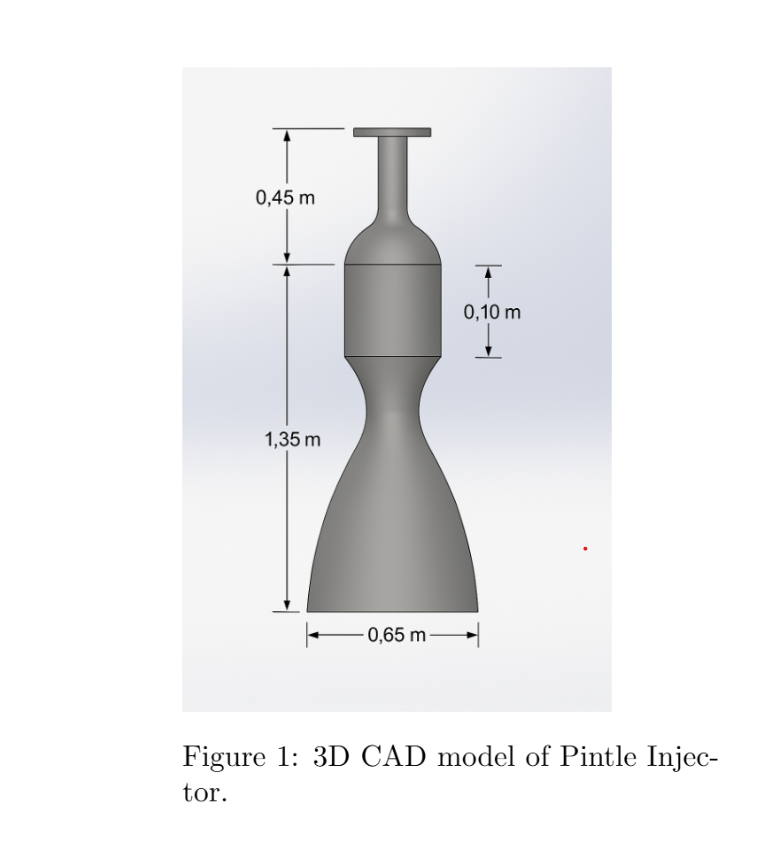

# 01 – Mission and System Design

## 1.1 Mission Overview

This project presents the conceptual design of a **30 kN pressure-fed hypergolic bipropellant rocket engine** using:

- Fuel: Monomethylhydrazine (MMH)
- Oxidizer: Nitrogen Tetroxide (NTO)
- Cycle: Pressure-fed
- Application: Robotic Lunar Descent

The engine provides controlled deceleration from Low Lunar Orbit (15–20 km altitude) to soft lunar surface landing.

---

## 1.2 Key Assumptions

- Vacuum Specific Impulse: $I_{sp} = 315 \, \text{s}$
- Chamber Pressure: $P_c = 20 \, \text{bar}$
- Thrust: $T = 30 \, \text{kN}$
- Lunar gravity: $g_{moon} = 1.62 \, \text{m/s}^2$
- Earth gravity constant: $g_0 = 9.81 \, \text{m/s}^2$

---

## 1.3 Delta-V Requirement

Estimated descent requirement:

$$
\Delta V \approx 1800 \, \text{m/s}
$$

---

## 1.4 Mass Budget

Using the Tsiolkovsky Rocket Equation:

$$
\Delta V = I_{sp} \, g_0 \ln\left(\frac{m_{wet}}{m_{dry}}\right)
$$

Solving for mass ratio:

$$
\frac{m_{wet}}{m_{dry}} = e^{\frac{\Delta V}{I_{sp} g_0}}
$$

Substituting:

$$
\frac{m_{wet}}{m_{dry}} = e^{\frac{1800}{315 \times 9.81}} \approx 1.79
$$

If:

$$
m_{dry} = 1200 \, \text{kg}
$$

Then:

$$
m_{wet} = 1.79 \times 1200 = 2148 \, \text{kg}
$$

Propellant Mass:

$$
m_{prop} = m_{wet} - m_{dry} = 948 \, \text{kg}
$$

Propellant Mass Fraction:

$$
\lambda = \frac{m_{prop}}{m_{wet}} \approx 0.44
$$

---

## 1.5 Engine Sizing

Exhaust velocity:

$$
v_e = I_{sp} \cdot g_0
$$

$$
v_e = 315 \times 9.81 = 3090 \, \text{m/s}
$$

Mass flow rate:

$$
\dot{m} = \frac{T}{v_e}
$$

$$
\dot{m} = \frac{30000}{3090} \approx 9.71 \, \text{kg/s}
$$

Burn time:

$$
t_{burn} = \frac{m_{prop}}{\dot{m}}
$$

$$
t_{burn} = \frac{948}{9.71} \approx 98 \, \text{s}
$$

 ---

## 1.6 Initial CAD Model Summary

An axisymmetric 3D CAD model of the pressure-fed hypergolic engine was developed to validate
geometric feasibility, combustion chamber sizing, and nozzle expansion requirements.
### Engine CAD Model

  

**Figure 1.** 3D CAD model of the pressure-fed hypergolic engine showing chamber length, throat diameter, exit diameter, and total engine height.

The model includes:

- Cylindrical combustion chamber
- Converging throat section
- Bell-shaped vacuum-optimized nozzle
- Pintle injector interface region
- Regenerative cooling wall allowance

---

### 🔹 1.6.1 Chamber Geometry Design

The combustion chamber geometry was derived from the characteristic length relation:

$$
V_c = A_t \cdot L^*
$$

where:

- $V_c$ = chamber volume  
- $A_t$ = throat area  
- $L^*$ = characteristic length  

---

### 🔹 Throat Area

Given:

$$
d_t = 0.05 \, \text{m}
$$

$$
A_t = \frac{\pi}{4} d_t^2
$$

$$
A_t = \frac{\pi}{4} (0.05)^2 = 1.963 \times 10^{-3} \, \text{m}^2
$$

---

### 🔹 Chamber Volume

Using:

$$
L^* = 1.0 \, \text{m}
$$

$$
V_c = 1.963 \times 10^{-3} \, \text{m}^3
$$

---

### 🔹 Chamber Length

Assuming chamber diameter:

$$
D_c = 0.075 \, \text{m}
$$

Chamber cross-sectional area:

$$
A_c = \frac{\pi}{4} D_c^2
$$

$$
A_c = 4.42 \times 10^{-3} \, \text{m}^2
$$

Chamber length:

$$
L_c = \frac{V_c}{A_c}
$$

$$
L_c \approx 0.444 \, \text{m}
$$

Thus, the chamber length is approximately **44 cm**.

---

### 🔹 1.6.2 Nozzle Expansion Geometry

Selected expansion ratio:

$$
\varepsilon = \frac{A_e}{A_t} = 30
$$

Exit diameter:

$$
d_e = d_t \sqrt{\varepsilon}
$$

$$
d_e = 0.05 \times \sqrt{30}
$$

$$
d_e \approx 0.274 \, \text{m}
$$

This expansion ratio balances:

- High vacuum ISP
- Manageable nozzle size
- Structural mass constraints

---

### 🔹 1.6.3 Final CAD Dimensions Used

| Parameter | Value |
|-----------|--------|
| Chamber Pressure | 20 bar |
| Throat Diameter ($d_t$) | 50 mm |
| Exit Diameter ($d_e$) | 274 mm |
| Expansion Ratio ($\varepsilon$) | 30 |
| Characteristic Length ($L^*$) | 1.0 m |
| Chamber Length ($L_c$) | 0.44 m |
| Total Engine Height | ~1.35 m |

---

### 🔹 1.6.4 CAD Design Philosophy

The CAD model was created with the following design considerations:

- Axisymmetric geometry for stable combustion
- Smooth converging section to minimize flow separation
- Bell-shaped nozzle for vacuum optimization
- Wall thickness allowance for regenerative cooling
- Injector mounting interface compatibility

This CAD model serves as the geometric foundation for:

- Thermal analysis
- Structural stress estimation
- Cooling channel integration
- Injector integration studies
---

## 1.7 Mission and System Design Summary

The mission and system design phase established the foundational requirements driving the propulsion architecture of the lunar descent engine.

The primary objective was to design a propulsion system capable of delivering:

$$
\Delta V \approx 1800 \, \text{m/s}
$$

for controlled descent from Low Lunar Orbit (15–20 km altitude) to a soft lunar surface landing.

Using the Tsiolkovsky rocket equation:

$$
\Delta V = I_{sp} g_0 \ln \left( \frac{m_{wet}}{m_{dry}} \right)
$$

a mass ratio of:

$$
\frac{m_{wet}}{m_{dry}} \approx 1.79
$$

was determined, resulting in:

- Wet Mass: 2148 kg  
- Propellant Mass: 948 kg  
- Propellant Fraction: ~44%

---

### Engine Sizing Outcome

A thrust level of:

$$
T = 30 \, \text{kN}
$$

was selected to maintain an adequate thrust-to-weight ratio on the Moon:

$$
g_{moon} = 1.62 \, \text{m/s}^2
$$

The resulting propulsion parameters:

- Exhaust Velocity: 3090 m/s  
- Mass Flow Rate: ~9.7 kg/s  
- Burn Duration: ~98 seconds  

---

### System Architecture Decisions

The mission constraints led to the selection of:

- Pressure-fed propulsion cycle
- Hypergolic MMH/NTO propellant combination
- Pintle injector configuration
- Regenerative cooling strategy

These choices prioritize:

- High reliability
- Throttle capability (3:1 range)
- Structural simplicity
- Proven lunar mission heritage

---

### Design Significance

The mission-level analysis directly informed:

- Injector sizing requirements
- Tank pressurization design
- Chamber geometry selection
- Cooling system sizing
- Structural mass constraints

This section establishes the quantitative performance targets that govern all subsequent subsystem designs.

The mission design demonstrates a balanced propulsion solution optimized for reliability, performance, and lunar descent operational requirements.
