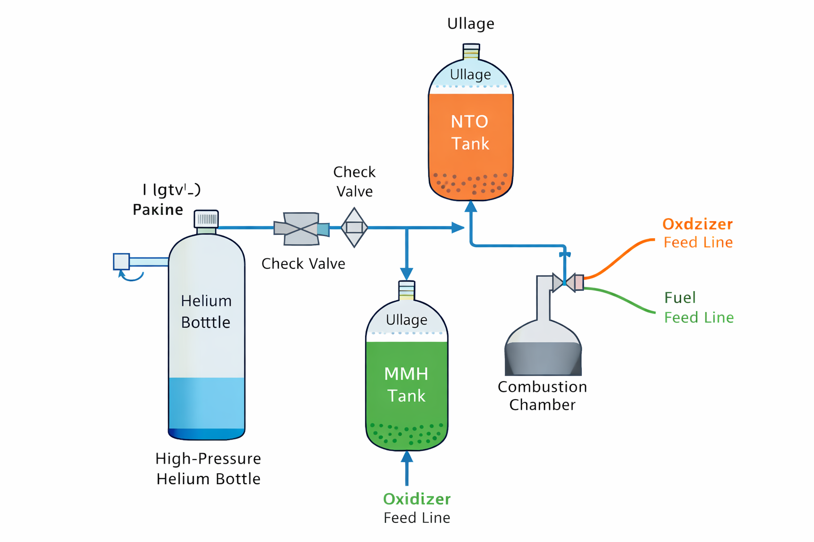

# 02 – Pressurization System Design

## 2.1 Pressurization System Overview

This engine uses a **pressure-fed** architecture where a high-pressure helium bottle is regulated to maintain
propellant tank ullage pressure throughout the burn. Helium is selected due to its inertness, low molecular
weight, and extensive flight heritage.

**Major components:**
- High-pressure helium storage tank
- Pressure regulator(s)
- Check valves
- Propellant tanks (MMH and NTO) with ullage volume
- Feed lines to injector

The pressurization system must maintain tank pressure high enough to support:
- Injector pressure drop
- Feed line losses
- Chamber pressure requirement

---

## 2.2 Target Pressures

Let:

- $P_c$ = chamber pressure  
- $\Delta P_{inj}$ = injector pressure drop  
- $\Delta P_{lines}$ = line losses (feed system)  
- $P_{tank}$ = required propellant tank pressure  

A minimum steady tank pressure requirement is:

$$
P_{tank} \ge P_c + \Delta P_{inj} + \Delta P_{lines}
$$

Injector pressure drop is commonly defined as a fraction of chamber pressure:

$$
\Delta P_{inj} = f \, P_c
$$

where $f$ is typically $0.15$–$0.30$ for stability margin.

If $\Delta P_{lines}$ is not yet modeled, a conservative placeholder can be used (e.g., 1–3 bar) and refined later.

---

## 2.3 Helium Storage Pressure

Helium is stored at high pressure $P_{He,store}$ (e.g., 150–300 bar) and regulated to tank pressure $P_{tank}$.
A blowdown system will show tank pressure decay unless regulated; therefore a regulated design is preferred.

---

## 2.4 Helium Mass Calculation

### 2.4.1 Propellant Volume

Total propellant mass:

$$
m_{prop} = m_{ox} + m_{fuel}
$$

Given densities $\rho_{ox}$ and $\rho_{fuel}$, propellant volumes are:

$$
V_{ox} = \frac{m_{ox}}{\rho_{ox}}, \qquad V_{fuel} = \frac{m_{fuel}}{\rho_{fuel}}
$$

Total propellant volume:

$$
V_{prop,total} = V_{ox} + V_{fuel}
$$

### 2.4.2 Ullage + Helium Volume

Let $u$ be ullage fraction (e.g., 3–5% of tank volume). If $V_{tank}$ is the total tank volume:

$$
V_{ullage} = u \, V_{tank}
$$

During burn, helium must replace the propellant volume removed. Therefore the helium volume delivered to
tanks (at tank conditions) is approximately:

$$
V_{He,delivered} \approx V_{prop,total} + V_{ullage}
$$

---

### 2.4.3 Ideal Gas Law for Helium Mass

Using the ideal gas law:

$$
m_{He} = \frac{P_{tank} \, V_{He,delivered}}{R_{He}\,T}
$$

where:
- $R_{He} = 2077 \, \text{J/(kg·K)}$
- $T$ is helium temperature (assume 293 K unless otherwise specified)
- $P_{tank}$ in Pa
- $V$ in m³

A sizing margin is recommended:

$$
m_{He,final} = (1 + \alpha)\,m_{He}
$$

where $\alpha$ is typically 0.10–0.30.

---

## 2.5 Pressurization System Summary

The pressurization sizing process defines:
- Required tank pressure as a function of $P_c$ and injector drop fraction $f$
- Helium mass required to replace consumed propellant volume
- Storage pressure requirements to provide sufficient helium mass with regulator margin

This section provides the system-level pressure boundary conditions that directly impact:
- Injector sizing and stability
- Tank structural thickness
- Regulator selection and safety factors

---

## 2.6 System Diagram (Recommended Figure)

Include a block diagram showing:

- Helium bottle → regulator → check valve → propellant tank ullage
- Tank outlets → feed lines → injector → chamber

  

  <em>Figure 2: Pressure-fed helium pressurization architecture showing helium bottle, regulator, check valves, propellant tanks, and feed lines to the combustion chamber.</em>

---

## 2.7 Internal Flow Diagram (Recommended Figure)

A simplified internal flow path is recommended to show:

- Helium pressurization path
- Oxidizer feed path
- Fuel feed path
- Injector interface region

This diagram supports traceability between pressure requirements and injector design.
