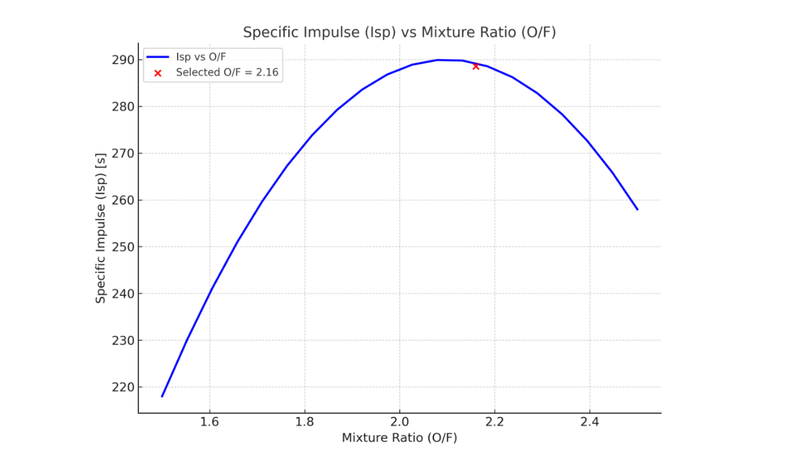
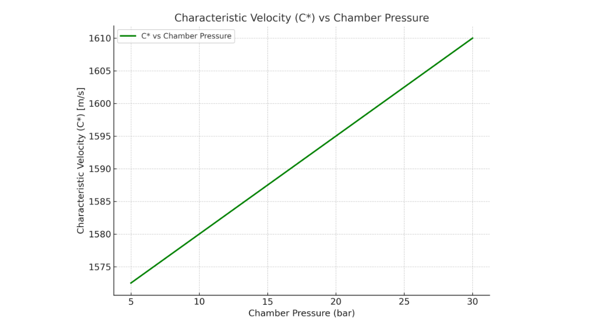
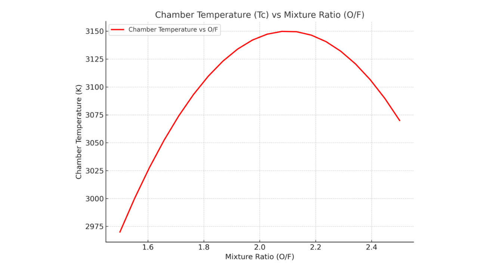

# Combustion Analysis using NASA CEA

## 1. Introduction

NASA's **Chemical Equilibrium with Applications (CEA)** tool was used to model the thermodynamic performance of the MMH/NTO propellant combination for the lunar lander engine.

CEA provides equilibrium combustion properties including:

- Specific impulse (Isp)
- Characteristic velocity (C*)
- Chamber temperature (Tc)
- Exhaust composition
- Molecular weight

---

## 2. CEA Input Parameters

| Parameter | Value |
|------------|--------|
| Fuel | MMH (C1H5N2) |
| Oxidizer | NTO (N2O4) |
| Chamber Pressure | 10 bar |
| Mixture Ratio (O/F) | 2.16 |
| Expansion Ratio (ε) | 30 |
| Flow Model | Equilibrium + Frozen |

---

## 3. Key CEA Outputs

| Output | Value |
|--------|--------|
| Vacuum Specific Impulse (Isp) | ≈ 288.6 s |
| Chamber Temperature (Tc) | ≈ 3130 K |
| Characteristic Velocity (C*) | ≈ 1600 m/s |
| Molecular Weight | ≈ 22 g/mol |
| Major Species | H₂O, CO₂, N₂, NOx |

---

## 4. Performance Trends

### 4.1 Isp vs Mixture Ratio (O/F)

**Observation:**  
Peak Isp occurs near O/F ≈ 2.1–2.2.  
Selected O/F = 2.16 operates near optimal efficiency.

---

### 4.2 Characteristic Velocity (C*) vs Chamber Pressure

**Observation:**  
C* increases slightly with chamber pressure due to improved reaction rates and combustion efficiency.

---

### 4.3 Chamber Temperature vs Mixture Ratio

**Observation:**  
Chamber temperature peaks near O/F ≈ 2.1.  
Fuel-rich or oxidizer-rich conditions reduce temperature.

---

## 5. Design Implications

- O/F = 2.16 selected for near-maximum Isp.
- Chamber pressure range (10–20 bar) ensures stable combustion.
- CEA confirms thermodynamic feasibility of MMH/NTO combination.
- Results support pressure-fed architecture selection.

---

## 6. Reference

Full combustion modeling details available in the project technical report.

