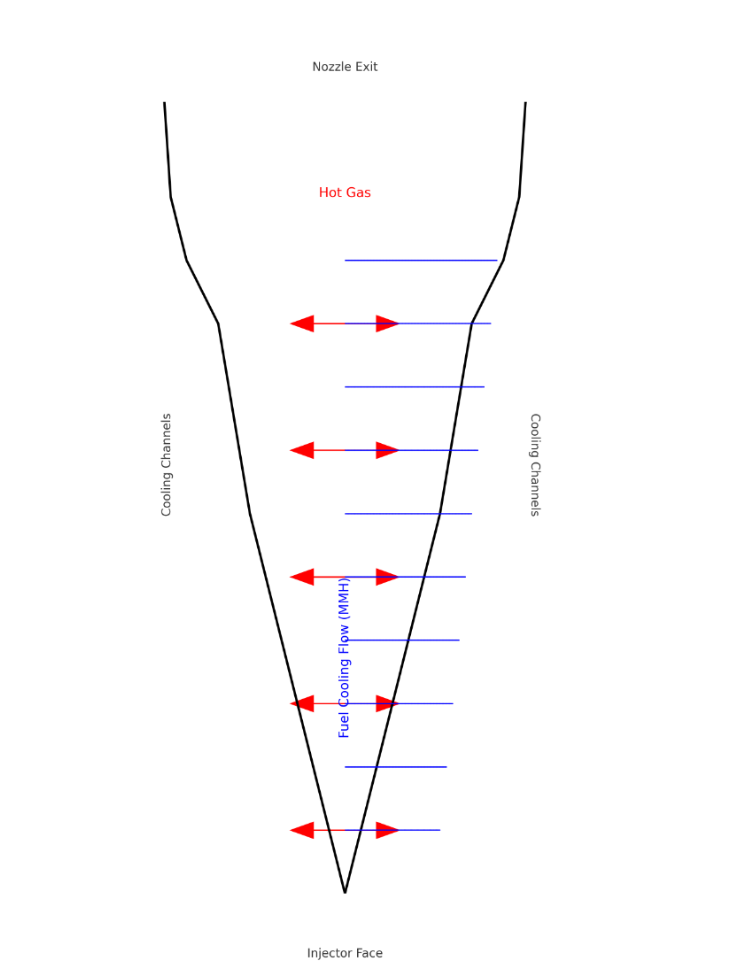

# Cooling System Design

## 1. Introduction

The combustion chamber and nozzle experience extremely high thermal loads due to combustion temperatures exceeding **3000 K**.

To prevent structural failure, an **active regenerative cooling system** is implemented using MMH fuel as the coolant.

---

## 2. Heat Flux Estimation

Maximum heat flux occurs at the throat region.

Estimated using:

q'' = 0.5 × Pc × ve

Where:

- q'' = Heat flux (W/m²)
- Pc = Chamber pressure (Pa)
- ve = Exhaust velocity (m/s)

Assuming:

- Pc = 20 bar = 2 × 10⁶ Pa
- ve ≈ 3000 m/s

q'' ≈ 0.5 × (2×10⁶) × 3000  
q'' ≈ 3.0 × 10⁹ W/m²

This indicates extremely high thermal loading near the throat.

---

## 3. Cooling Method Selection

### Regenerative Cooling (Selected)

Fuel (MMH) flows through cooling channels embedded in the chamber wall before injection.

Advantages:

- Removes high heat flux
- Preheats fuel (improves combustion efficiency)
- Structurally efficient
- Proven in lunar descent engines

---

## 4. Wall Thickness Estimation

Using simplified 1D conduction:

q'' = k ΔT / t

Rearranging:

t = k ΔT / q''

Assuming:

- k = 300 W/m·K (Copper alloy)
- ΔT = 500 K allowable wall gradient
- q'' = 3 × 10⁶ W/m² (conservative throat average)

t = (300 × 500) / (3 × 10⁶)  
t ≈ 0.05 m  

Practical design would refine this using CFD and transient thermal analysis.

---

## 5. Material Selection

| Component | Material | Reason |
|------------|----------|--------|
| Inner Liner | GRCop-84 (Copper Alloy) | High thermal conductivity |
| Outer Jacket | Inconel / Stainless Steel | Structural strength |
| Cooling Channels | Integrated Helical Design | Uniform heat removal |

---

## 6. Cooling Architecture

Flow path:

Fuel Tank → Regenerative Channels → Injector → Combustion Chamber

The regenerative channels:

- Spiral around chamber
- Extend through nozzle
- Provide maximum heat removal at throat

---

## 7. Design Benefits

- Maintains wall temperature < 900 K
- Prevents thermal fatigue
- Improves overall engine life
- Reduces ignition delay (preheated fuel)

---

## 8. Future Improvements

- Detailed CFD heat transfer modeling
- Film cooling augmentation
- Thermal stress FEA validation
- Channel geometry optimization

---

## Conclusion

The regenerative cooling system ensures safe operation under high combustion temperatures while improving propellant efficiency and maintaining structural integrity for lunar descent operations.
