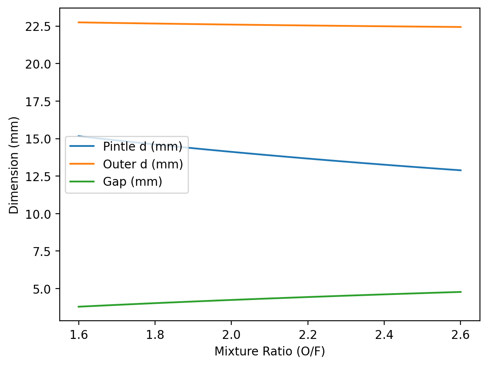
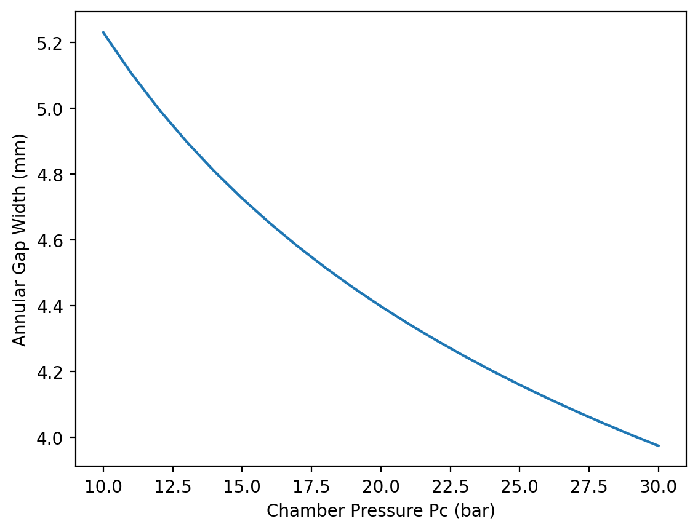
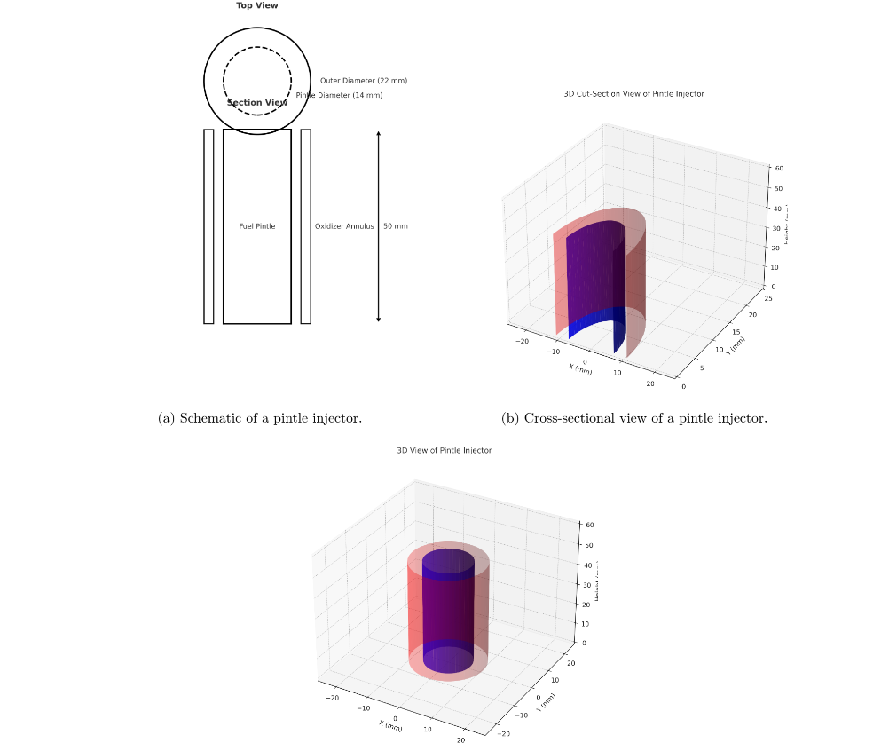

# 🚀 Pintle Injector Sizing & Analysis  
### Pressure-Fed MMH/NTO Hypergolic Engine Module

<p align="center">
  
</p>

<p align="center">
  Analytical | Parametric | Uncertainty-Aware Injector Design
</p>

---


---

# 📌 Overview

This module implements a complete analytical sizing workflow for a **pressure-fed pintle injector** used in a lunar descent bipropellant engine (MMH/NTO).

It converts classical propulsion equations into an automated computational tool capable of:

- Injector area sizing  
- Pintle diameter calculation  
- Annular gap determination  
- Discharge coefficient correction  
- Parametric sweeps  
- Monte Carlo uncertainty analysis  
- GUI-based evaluation  

---

# 🔥 Why Pintle Injector?

✔ Excellent throttling performance  
✔ High combustion stability  
✔ Fewer instability modes  
✔ Heritage from Apollo LMDE  
✔ Ideal for pressure-fed lunar engines  


# 🧮 Governing Equations

---

### 1️⃣ Effective Exhaust Velocity

$$
v_e = I_{sp} \, g_0
$$

Where:
- $I_{sp}$ = specific impulse (s)  
- $g_0 = 9.81 \, \text{m/s}^2$

---

### 2️⃣ Total Mass Flow Rate

$$
\dot{m} = \frac{T}{v_e}
$$

Where:
- $T$ = thrust (N)  
- $\dot{m}$ = total propellant mass flow rate (kg/s)

---

### 3️⃣ Mixture Ratio (O/F) Mass Split

$$
\dot{m}_{ox} = \dot{m} \cdot \frac{O/F}{1 + O/F}
$$

$$
\dot{m}_{fuel} = \dot{m} - \dot{m}_{ox}
$$

Where:
- $O/F$ = oxidizer-to-fuel mass ratio

---

### 4️⃣ Injector Pressure Drop

$$
\Delta P = f \, P_c
$$

Where:
- $P_c$ = chamber pressure  
- $f$ = pressure-drop fraction (0.10–0.20 typical)

---

### 5️⃣ Injection Area (Cd Corrected)

$$
A = \frac{\dot{m}}{C_d \sqrt{2 \rho \Delta P}}
$$

Where:
- $C_d$ = discharge coefficient  
- $\rho$ = propellant density  
- $\Delta P$ = injector pressure drop

---

### 6️⃣ Pintle Diameter (Fuel Jet)

$$
A_{fuel} = \frac{\pi}{4} d_{pintle}^2
$$

$$
d_{pintle} = \sqrt{\frac{4 A_{fuel}}{\pi}}
$$

---

### 7️⃣ Annular Oxidizer Geometry

$$
A_{ox} = \frac{\pi}{4} \left( d_{outer}^2 - d_{pintle}^2 \right)
$$

$$
d_{outer} = \sqrt{ d_{pintle}^2 + \frac{4 A_{ox}}{\pi} }
$$

Radial annular gap width:

$$
g = \frac{d_{outer} - d_{pintle}}{2}
$$
---

# ⚙ Reference Design Case

| Parameter | Value |
|------------|--------|
| Thrust | 30 kN |
| Isp | 315 s |
| Chamber Pressure | 20 bar |
| O/F | 2.16 |
| ΔP Fraction | 0.15 |
| Cd | 0.90 |

### 🔎 Typical Output

- Mass flow ≈ 9.7 kg/s  
- Pintle diameter ≈ 13–14 mm  
- Outer diameter ≈ 21–22 mm  
- Annular gap width ≈ 4 mm  

---

# 📈 Parametric Studies

## O/F Sweep

<p align="center">
  
</p>


Shows how mixture ratio affects:
- Pintle diameter  
- Outer diameter  
- Annular gap  

---

## Chamber Pressure Sweep

<p align="center">
  
</p>

Demonstrates geometric sensitivity to chamber pressure.

---

# 🎲 Monte Carlo Uncertainty Analysis

This module evaluates uncertainty in:

- Thrust variation  
- Chamber pressure  
- Density variation  
- Discharge coefficient  
- ΔP fraction  

Outputs include:

- Mean values  
- Standard deviation  
- 5th–95th percentile bounds  

This provides engineering confidence intervals rather than single-point estimates.

---

# 🖥 How To Run

### Activate Virtual Environment

```bash
python -m venv .venv
.\.venv\Scripts\Activate
pip install matplotlib
```

---

### CLI Sizing

```bash
python src/injector_sizing.py
```

---

### Parametric Sweeps

```bash
python src/sweeps.py
```

---

### Monte Carlo Analysis

```bash
python src/monte_carlo.py
```

---

### GUI Version

```bash
python src/gui.py
```
## 🧩 Injector Geometry (CAD/Schematic)

<p align="center">
  
</p>

<p align="center">
  <em>Figure: Pintle injector schematic and 3D views (top view, cross-section, and full 3D).</em>
</p>
---

# 🧠 Engineering Concepts Demonstrated

- Hypergolic injector physics  
- Pressure-fed propulsion dynamics  
- Fluid mechanics in injector design  
- Cd-based loss modeling  
- Parametric automation  
- Uncertainty quantification  
- Computational propulsion tools  

---

# 👩‍🚀 Author

**Mounapriya Venkatesan**  
Graduate Student – Space Studies  
Rice University  

---

# ⭐ Future Enhancements

- Cavitation risk modeling  
- Injector spray angle modeling  
- CFD validation  
- Optimization-based sizing  
- Transient ignition simulation  


